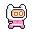

# Tales of Anxiety

> Learn how to cope with the anxiety monster in this mini-browser game. 

**[- Link to Game -](https://paulinemss.github.io/tales-of-anxiety/)**

### What is Tales of Anxiety? 

Everyone feels anxious sometimes. Tales of Anxiety is a 3-levels browser game that allows you to run away from your anxiety monster - at least for a little while. 

### Portfolio Project

Tales of Anxiety is a JavaScript game built using p5.js and p5.play libraries and created by [Pauline Massé](https://github.com/paulinemss). The assets were designed by [Pixel Frog](https://pixelfrog-store.itch.io/).  